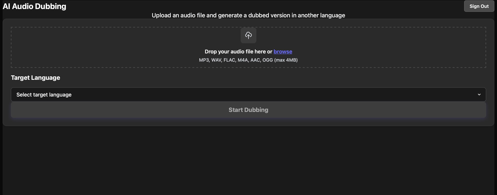
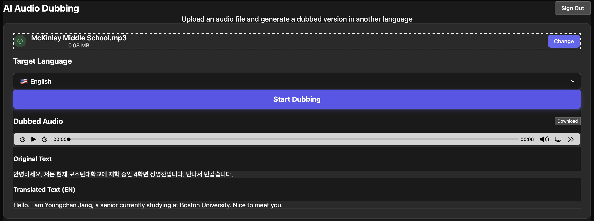

# AI Audio Dubbing Service

Live Demo  
https://perso-ai-dubbing.vercel.app

## Demo

### Main Interface

### Dubbing Result

AI Audio Dubbing is a web application that automatically translates spoken audio into another language and generates dubbed speech using AI.

Users can upload an audio file, choose a target language, and the system will transcribe, translate, and generate a dubbed audio file that can be played and downloaded directly from the browser.

---

# Service Overview

This service demonstrates an AI-powered pipeline that converts speech from one language into another.

The workflow is as follows:

1. Upload an audio file
2. Transcribe the speech using AI (Speech-to-Text)
3. Translate the text into another language
4. Generate dubbed audio using Text-to-Speech
5. Play the generated audio in the browser
6. Download the dubbed audio file

The application provides a simple interface that allows users to perform multilingual dubbing without any technical setup.

---

# Main Features

- Upload audio files (MP3, WAV, FLAC, M4A, AAC, OGG)
- Automatic speech recognition (Speech-to-Text)
- Automatic translation into another language
- AI-generated dubbed audio (Text-to-Speech)
- In-browser audio playback
- Download generated dubbed audio
- Google authentication login
- Deployed cloud service via Vercel

---

# Tech Stack

### Frontend
- Next.js
- TypeScript
- Tailwind CSS

### AI Services
- OpenAI API
- ElevenLabs

### Database
- Turso (SQLite edge database)

### Authentication
- Google OAuth

### Deployment
- Vercel

---

# Local Development

### 1. Clone the repository

git clone https://github.com/yeongchan-dev/perso-ai-dubbing.git

### 2. Move into the project directory

cd perso-ai-dubbing

### 3. Install dependencies

npm install

### 4. Set environment variables

Create a `.env.local` file and add your API key.

OPENAI_API_KEY=your_api_key

See .env.example for required environment variablesa

### 5. Run the development server

npm run dev

Open in browser:

http://localhost:3000

---

# Deployed Service URL

The deployed application can be accessed here:

https://perso-ai-dubbing.vercel.app

---

# Using AI Coding Agents

This project was primarily developed using **Claude** as a coding agent for generating and implementing the core application logic and UI components.

Additional assistance from **ChatGPT** was used for debugging support, documentation guidance, and development explanations.

AI coding agents were used for:

- Generating and refining frontend UI code
- Implementing application logic
- Debugging build and runtime errors
- Improving user interface readability and usability
- Fixing deployment issues
- Assisting with project documentation

Through iterative interaction with AI coding agents, the development process became significantly faster and more efficient.

---

# Limitations and Scope Decision

This project currently supports **audio dubbing only**.

During development, video dubbing functionality was considered. However, the deployed production environment (Vercel serverless architecture) introduced several limitations when handling large media files such as videos.

Key limitations included:

- Serverless environments have strict limits on file size and processing time
- Video files require significantly more storage and processing resources than audio files
- Temporary file handling for large media uploads was less reliable in the deployed environment
- Processing large video files would require a more complex storage and processing pipeline

Because the goal of this project was to deliver a **stable deployed service**, the final scope was intentionally limited to audio input and audio output.

Future versions of this project could extend the architecture to support full video dubbing by introducing more advanced media storage and processing workflows.

---

# Future Improvements

Possible future extensions include:

- Video dubbing support
- Multiple target language options
- Improved UI/UX design
- Audio waveform visualization
- Batch processing for multiple files